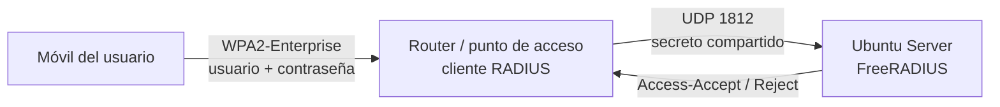

# Wi-Fi WPA2-Enterprise con FreeRADIUS

Práctica del **CFGS ASIR** · IES María Enríquez · 2024
Autor: **Carlos Aparici Pérez**

Servidor **FreeRADIUS** en **Ubuntu Server** que autentica a cada usuario de una red Wi-Fi con su propio usuario y contraseña (**WPA2-Enterprise**), en lugar de compartir una única clave. Probado con un router real y un móvil.

## Por qué

Con una clave Wi-Fi compartida no se sabe quién se conecta ni se puede retirar el acceso a una sola persona. Con RADIUS, el acceso se gestiona de forma **centralizada y por usuario**, algo habitual en empresas y centros educativos.



## Pasos

1. **Instalación**
   ```bash
   sudo apt update
   sudo apt install freeradius freeradius-utils
   sudo systemctl enable --now freeradius
   ```
2. **Clientes RADIUS** (los routers autorizados a consultar) en `/etc/freeradius/3.0/clients.conf` → [`config/clients.conf.example`](config/clients.conf.example)
3. **Usuarios** en `/etc/freeradius/3.0/users` → [`config/users.example`](config/users.example)
4. **Pruebas en local**
   ```bash
   sudo freeradius -X                                  # arranque en modo depuración
   radtest <usuario> <contraseña> <ip_router> 0 <secreto>   # debe responder Access-Accept
   ```
5. **Router:** seguridad *WPA2-Enterprise*, IP del servidor RADIUS, puerto **1812** y el mismo secreto compartido.
6. **Prueba real:** conexión desde un móvil al SSID con las credenciales del usuario → acceso concedido.

## Comprobaciones antes de culpar a RADIUS

- El router tiene conectividad con el servidor (puerta de enlace y DNS correctos).
- El servidor es alcanzable desde la red del router.
- El router está conectado **físicamente**.
- El secreto compartido es idéntico en `clients.conf` y en el router.

## Qué aprendí

Integrar un servidor de autenticación con puntos de acceso y depurar con `freeradius -X`, que muestra paso a paso por qué se acepta o rechaza cada petición.

> Los secretos y contraseñas de este repositorio son marcadores de ejemplo.

## Tecnologías

`Ubuntu Server` `FreeRADIUS 3` `RADIUS` `WPA2-Enterprise` `802.1X`
